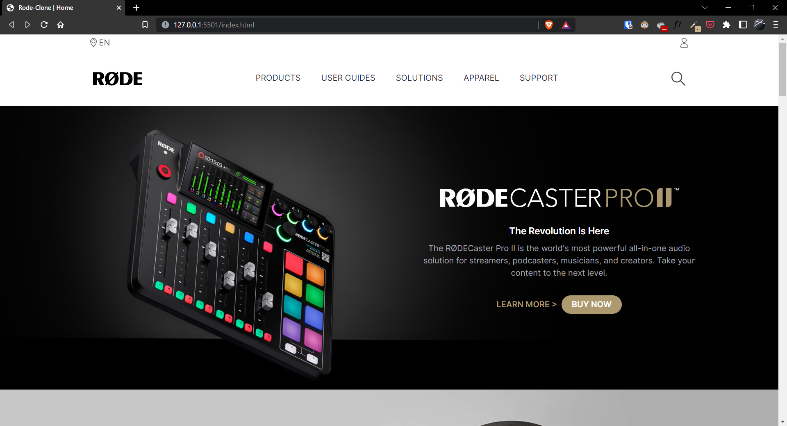
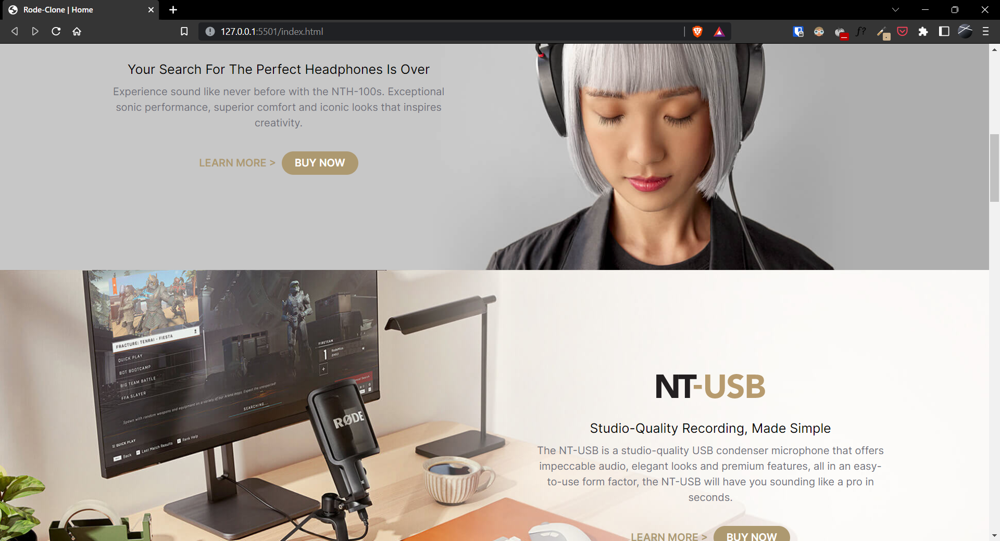
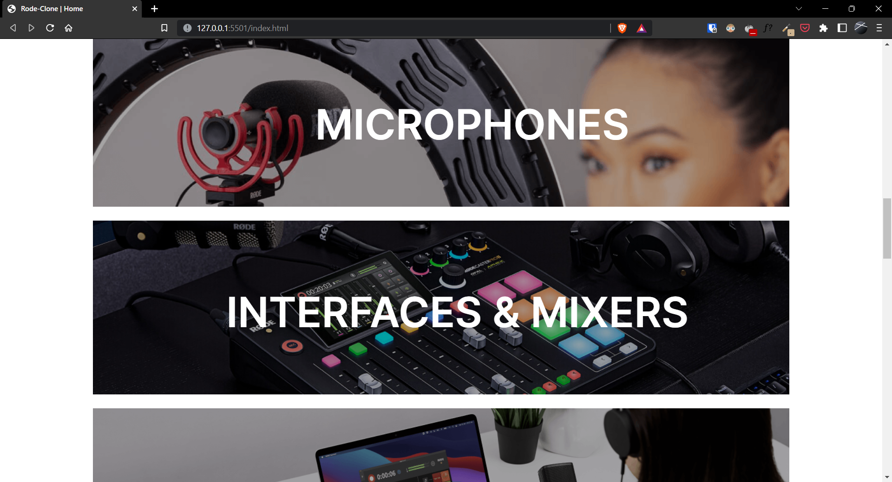
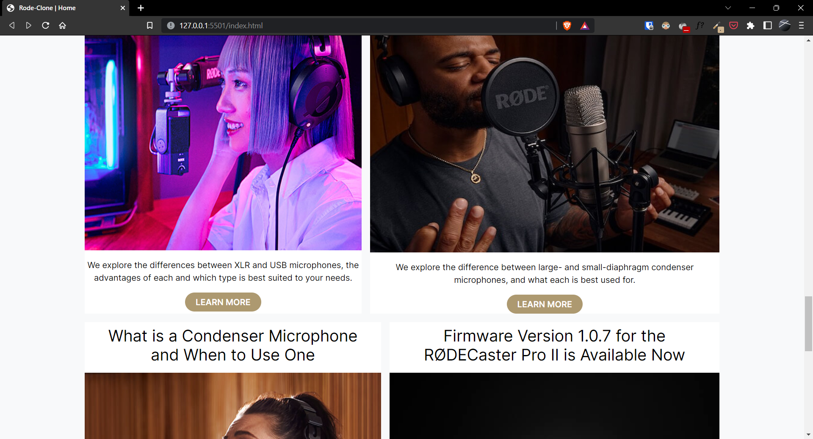

# Project-18 | Rode Clone

Hi there,
I'm Wasit Ali and this is my 18th project and 3rd project in HTML and Tailwind CSS.

## 🖥 Preview

🚀 [Live Preview](https://rode-clone-project-18.vercel.app/)

## 🛠️ What I have learned in this project?

- Explored the extensive capabilities of Tailwind CSS and its wide range of practical use cases.
- Handled mobile responsive entirely with Tailwind CSS.
- Developed troubleshooting and problem-solving abilities.
- Proficient in reading and utilizing Tailwind CSS documentation.

## ⏲ Time taken to finish the project

- It took me 3-4 days.
